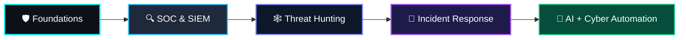

<div align="center">

  <!-- TOP BANNER / HERO IMAGE -->
  

  <!-- DYNAMIC TYPING SVG -->
  <a href="https://github.com/sadhna1118">
    
  </a>

  <p align="center">
    <a href="https://www.linkedin.com/in/sadhna1615b333b/"></a>
    <a href="https://sadhna1118.github.io/personal-portfolio/"></a>
    <a href="mailto:sadhanakumari181106@gmail.com"></a>
    <a href="https://github.com/sadhna1118?tab=repositories"></a>
    
  </p>

</div>

---

### 💫 About Me & Vision

```yaml
identity:
  name: "Sadhna"
  education: "BCA Student & Lifelong Technologist"
  core_focus:
    - "Cybersecurity Operations (SOC, Threat Hunting, Incident Response)"
    - "AI-Powered Security, RAG & Autonomous Intelligent Agents"
    - "Modern Scalable Full-Stack Engineering & Cloud Systems"
    - "Data Intelligence, Analytics & Visual Dashboards"
  motto: "Learn ➔ Build ➔ Hunt ➔ Defend ➔ Automate ➔ Improve"
  status: "🟢 Open for security research collaborations, internships & innovative projects"
```

<table align="center" width="100%">
  <tr>
    <td width="55%" valign="top">
      <h4>⚡ Quick Overview</h4>
      <ul>
        <li>🛡️ <b>Defensive Security:</b> Building automated SOC pipelines, MITRE ATT&CK correlation engines, and threat intelligence graphs.</li>
        <li>🤖 <b>Generative AI & RAG:</b> Designing evidence-grounded agentic RAG workflows, voice AI, and multi-modal assistants.</li>
        <li>💻 <b>Software Engineering:</b> Crafting modern, high-performance web apps with <b>FastAPI, React, TypeScript & Docker</b>.</li>
        <li>📊 <b>Data Analytics:</b> Unlocking patterns with <b>SQL, Python (Pandas/NumPy), Power BI (DAX)</b>.</li>
        <li>🏆 <b>National Winner:</b> 2nd Prize at <i>National AI Make-a-thon (Dell Technologies & LLF)</i>.</li>
      </ul>
    </td>
    <td width="45%" align="center" valign="middle">
      
    </td>
  </tr>
</table>

---

## 🛠️ Tech Arsenal & Skill Matrix

<div align="center">

### 🛡️ Cybersecurity, SOC & Blue-Team Operations
<p>
  
  
  
  
  
  
</p>
<p>
  
  
  
  
  
</p>

### 🤖 Artificial Intelligence & Data Science
<p>
  
  
  
  
  
  
  
</p>

### 💻 Full-Stack Development & Tooling
<p align="center">
  
</p>

</div>

---

## 🔥 Featured Projects Spotlight

<table>
  <tr>
    <td width="50%" valign="top">
      <h3 align="center"><a href="https://github.com/sadhna1118/ThreatGraph-X" style="text-decoration:none;">🕸️ ThreatGraph-X</a></h3>
      <p align="center">
        
        
      </p>
      <p><b>Threat Hunting & Attack-Chain Intelligence Platform</b> that converts raw security telemetry into connected entities, investigation graphs, and actionable defense intelligence.</p>
      <ul>
        <li>🔎 Graph-powered multi-hop attack chain analysis (Neo4j + NetworkX)</li>
        <li>🎯 Automated MITRE ATT&CK Matrix mapping & anomaly detection</li>
        <li>🤖 Grounded AI Security Analyst Assistant for instant triage</li>
      </ul>
      <p><b>Tech:</b> <code>Python</code> <code>FastAPI</code> <code>React</code> <code>TypeScript</code> <code>Neo4j</code> <code>PostgreSQL</code> <code>Docker</code></p>
    </td>
    <td width="50%" valign="top">
      <h3 align="center"><a href="https://github.com/sadhna1118/SentinelSOC" style="text-decoration:none;">🚨 SentinelSOC</a></h3>
      <p align="center">
        
        
      </p>
      <p><b>Security Operations & Incident Triage Platform</b> tailored for ingestion, real-time detection rule evaluation, alert correlation, and SOC workflow automation.</p>
      <ul>
        <li>📡 Live event telemetry streaming via WebSockets</li>
        <li>📋 Custom YAML detection rule engine & alert scoring</li>
        <li>🔍 Accelerated incident investigation and log correlation</li>
      </ul>
      <p><b>Tech:</b> <code>Python</code> <code>FastAPI</code> <code>WebSockets</code> <code>Pydantic</code> <code>YAML</code> <code>AsyncIO</code></p>
    </td>
  </tr>
  <tr>
    <td width="50%" valign="top">
      <h3 align="center"><a href="https://github.com/sadhna1118/CyberRange" style="text-decoration:none;">🧪 CyberRange</a></h3>
      <p align="center">
        
        
      </p>
      <p><b>Practical Cybersecurity Lab & Simulation Ground</b> for offensive/defensive tooling, network traffic capture, and vulnerability remediation.</p>
      <ul>
        <li>🌐 Network traffic analysis & packet dissection (Wireshark/TShark)</li>
        <li>🛡️ Vulnerability exploitation & defense playbooks (Nmap, Gobuster, SQLMap)</li>
        <li>📜 Automated audit logging & security scenario walkthroughs</li>
      </ul>
      <p><b>Tech:</b> <code>Python</code> <code>Kali Linux</code> <code>Bash</code> <code>Nmap</code> <code>Wireshark</code> <code>Security Tools</code></p>
    </td>
    <td width="50%" valign="top">
      <h3 align="center"><a href="https://github.com/sadhna1118/Voice-RAG-project" style="text-decoration:none;">🧠 Voice & Agentic RAG</a></h3>
      <p align="center">
        
        
      </p>
      <p><b>Intelligent Retrieval-Augmented Generation (RAG) Suite</b> with multi-agent orchestration and voice interaction capabilities.</p>
      <ul>
        <li>🎙️ Real-time voice query pipeline with multi-step reasoning agents</li>
        <li>📚 Evidence-grounded retrieval from complex enterprise & security knowledge bases</li>
        <li>⚡ Hallucination-resistant context synthesis & tool calling</li>
      </ul>
      <p><b>Tech:</b> <code>Python</code> <code>RAG</code> <code>Vector DB</code> <code>LLMs</code> <code>LangChain / Agents</code> <code>FastAPI</code></p>
    </td>
  </tr>
  <tr>
    <td width="50%" valign="top">
      <h3 align="center"><a href="https://github.com/sadhna1118/Femcare" style="text-decoration:none;">🌸 FemCare</a></h3>
      <p align="center">
        
        
      </p>
      <p><b>AI-powered Female Health Companion</b> providing personalized wellness insights, intelligent symptom tracking, and secure health data management.</p>
      <ul>
        <li>💬 Interactive AI wellness assistant and personalized cycles tracker</li>
        <li>🔒 Secure, privacy-first database architecture with Firebase</li>
        <li>📱 Modern, accessible, intuitive user experience</li>
      </ul>
      <p><b>Tech:</b> <code>Flutter / React</code> <code>Firebase</code> <code>Python / AI</code> <code>Cloud Services</code></p>
    </td>
    <td width="50%" valign="top">
      <h3 align="center"><a href="https://github.com/sadhna1118/zomato-dashboard-Power-BI" style="text-decoration:none;">📊 Enterprise Data Analytics Suite</a></h3>
      <p align="center">
        
        
      </p>
      <p><b>Data Analytics & Predictive Modeling Portfolio</b> converting raw unstructured datasets into actionable business intelligence and dashboards.</p>
      <ul>
        <li>🍕 <b><a href="https://github.com/sadhna1118/zomato-dashboard-Power-BI">Zomato Power BI Dashboard</a>:</b> Order patterns, revenue & customer analytics (DAX, Power Query)</li>
        <li>🛍️ <b><a href="https://github.com/sadhna1118/Retail-Sales-SQL-Analysis">Retail Sales SQL Engine</a>:</b> Complex multi-table joins, KPIs & cohort insights</li>
        <li>🏠 <b><a href="https://github.com/sadhna1118/Housing-Price-Prediction-Project">Housing Price ML</a>:</b> Regression prediction modeling in Python</li>
      </ul>
      <p><b>Tech:</b> <code>Power BI</code> <code>SQL</code> <code>DAX</code> <code>Python</code> <code>Pandas</code> <code>NumPy</code></p>
    </td>
  </tr>
</table>

<details>
  <summary><b>📂 Click here to see Full Project Index & Categorized Breakdown</b></summary>
  <br/>

| Project | Domain | Key Technologies | Highlights |
|:---|:---|:---|:---|
| **[🔥 ThreatGraph-X](https://github.com/sadhna1118/ThreatGraph-X)** | Cybersecurity / Threat Hunting | FastAPI, React, Neo4j, PostgreSQL, Docker | Entity-relationship attack graphs & AI investigation |
| **[🛡️ SentinelSOC](https://github.com/sadhna1118/SentinelSOC)** | SOC / Threat Detection | Python, FastAPI, WebSockets, YAML Rules | Realtime telemetry stream & automated triage |
| **[🧪 CyberRange](https://github.com/sadhna1118/CyberRange)** | Cyber Lab / Defensive Security | Linux, Nmap, Wireshark, SQLMap, Nikto | Blue-team exercises & attack simulation |
| **[🤖 Voice RAG System](https://github.com/sadhna1118/Voice-RAG-project)** | Artificial Intelligence / RAG | Python, Vector DB, LLMs, LangChain | Voice-enabled intelligent semantic search |
| **[🌸 FemCare](https://github.com/sadhna1118/Femcare)** | AI Health Application | Flutter/React, Firebase, AI Assistant | Privacy-first wellness tracking platform |
| **[📊 Zomato Analytics](https://github.com/sadhna1118/zomato-dashboard-Power-BI)** | Business Intelligence | Power BI, Power Query, DAX | Interactive KPIs and deep sales metrics |
| **[📈 Retail Sales Analysis](https://github.com/sadhna1118/Retail-Sales-SQL-Analysis)** | Data Engineering & SQL | SQL, PostgreSQL, Window Functions | Customer segmentation & revenue attribution |
| **[🎬 Netflix EDA & Housing ML](https://github.com/sadhna1118/Netflix-Data-Analysis)** | Machine Learning & Analytics | Python, Pandas, Matplotlib, Scikit-Learn | Exploratory trends & price regression models |

</details>

---

## 🏆 Achievements & Verified Certifications

```ascii
  _____________________________________________________________
 /                                                             \
|   [ 🥈 2nd Prize Winner ]                                     |
|   National AI Make-a-thon                                     |
|   Organized by Dell Technologies & Learning Links Foundation   |
 \_____________________________________________________________/
```

- 🥈 **2nd Prize – National AI Make-a-thon** | *Dell Technologies & Learning Links Foundation*
- 📜 **Artificial Intelligence Professional Certification** | *Infosys Springboard*
- 📜 **AI & Employability Skills Certification (80+ Hours Training)** | *ICA Edu Skills*

---

## 📈 GitHub Metrics & Real-Time Stats

<div align="center">
  <table border="0">
    <tr>
      <td align="center">
        <a href="https://github.com/sadhna1118">
          
        </a>
      </td>
      <td align="center">
        <a href="https://github.com/sadhna1118">
          
        </a>
      </td>
    </tr>
    <tr>
      <td colspan="2" align="center">
        <a href="https://github.com/sadhna1118">
          
        </a>
      </td>
    </tr>
  </table>

  ### 🐍 Contribution Activity Matrix
  
  <picture>
    <source media="(prefers-color-scheme: dark)" srcset="https://raw.githubusercontent.com/sadhna1118/sadhna1118/output/github-snake-dark.svg">
    <source media="(prefers-color-scheme: light)" srcset="https://raw.githubusercontent.com/sadhna1118/sadhna1118/output/github-snake-light.svg">
    
  </picture>

</div>

---

## 🎯 Current Objectives & Learning Roadmap

<div align="center">



</div>

---

## 🌐 Let's Connect & Collaborate!

<div align="center">

  <p>I'm always excited to collaborate on open-source tools, cybersecurity research, AI initiatives, or discuss new opportunities!</p>

  <a href="https://www.linkedin.com/in/sadhna1615b333b/"></a>
  &nbsp;
  <a href="https://sadhna1118.github.io/personal-portfolio/"></a>
  &nbsp;
  <a href="mailto:sadhanakumari181106@gmail.com"></a>
  &nbsp;
  <a href="https://github.com/sadhna1118"></a>

  <br/><br/>

  

  <p>⭐ <i>Crafted with passion for Cybersecurity & Artificial Intelligence by <b>Sadhna</b></i> ⭐</p>

</div>
